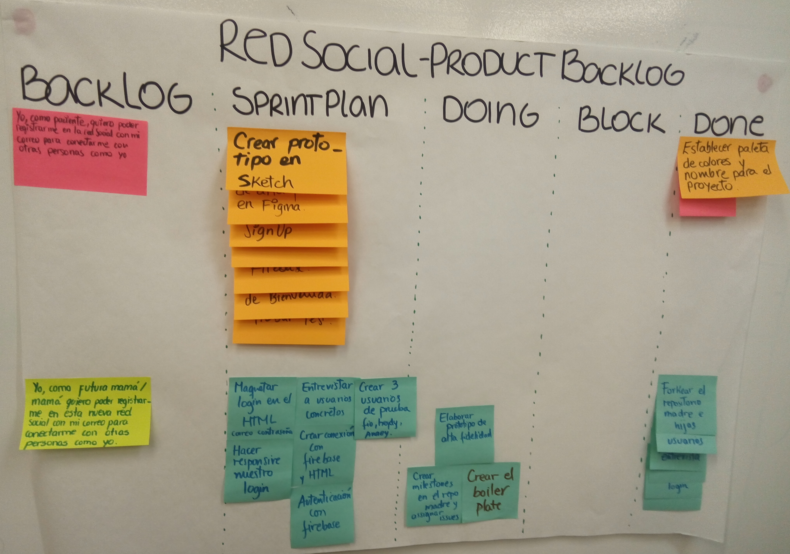
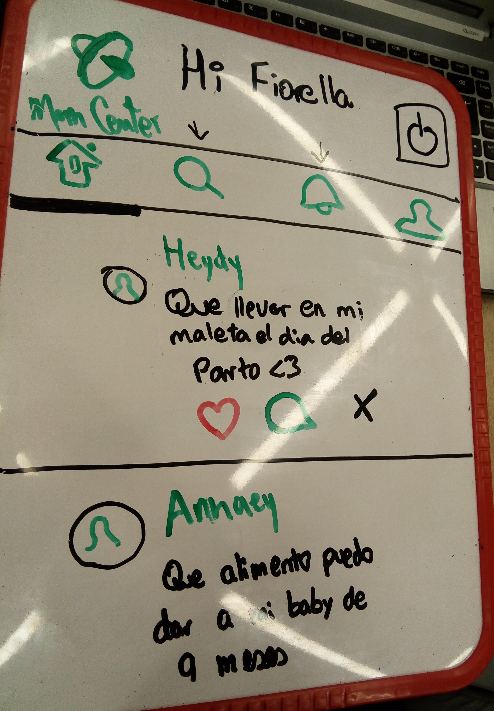
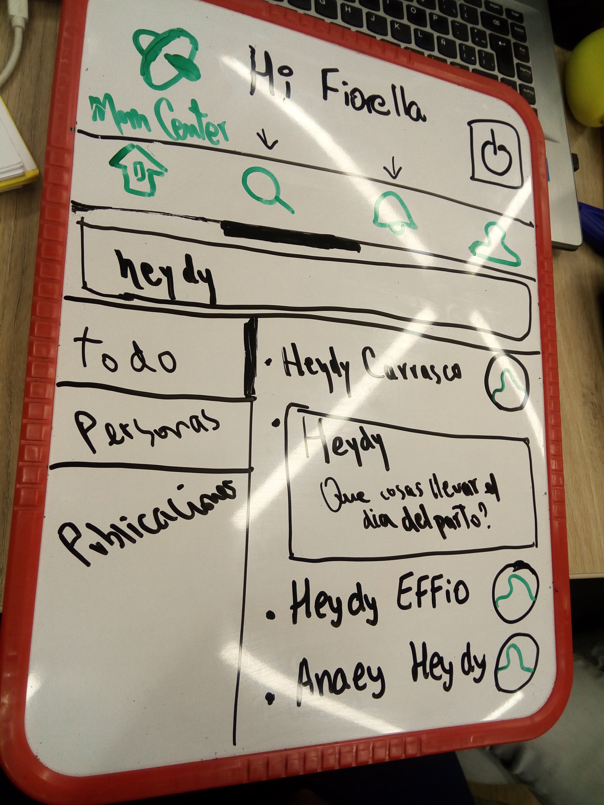
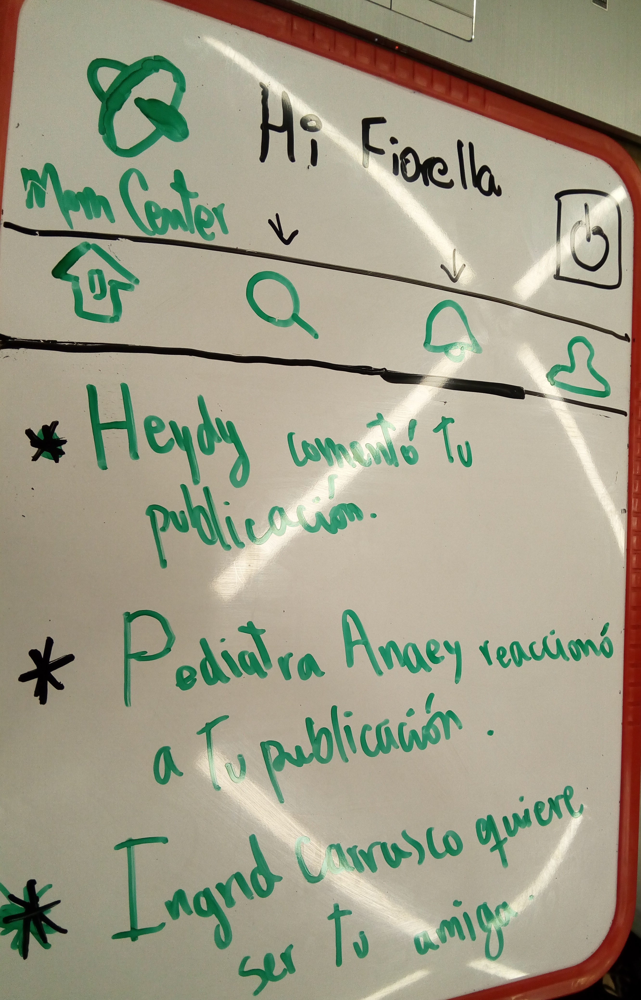
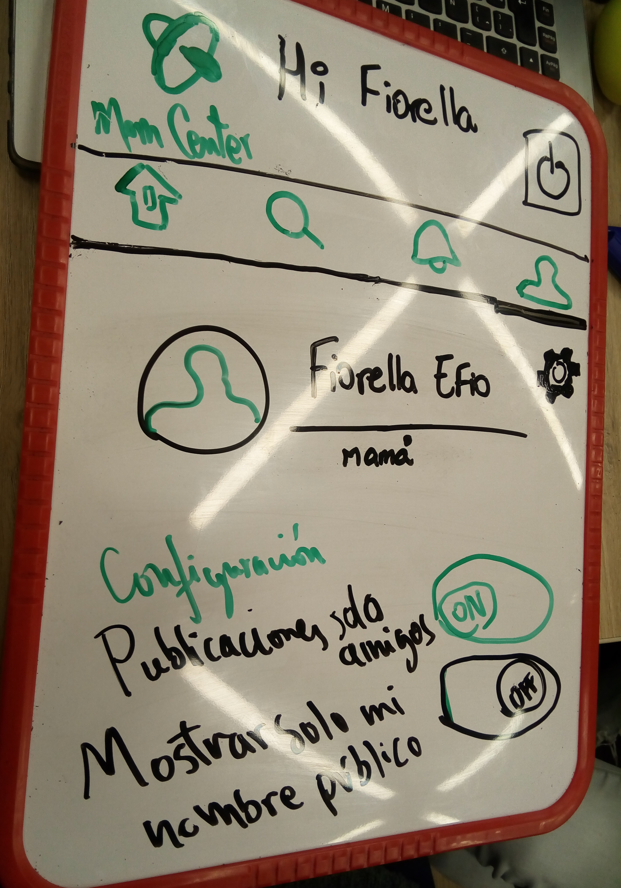

# Red Social para Mamis - Mom Center

## Introducción

El crecimiento de la tasa de natalidad en el Perú y con la problemática que genera el sistema de salud en nuestro
país trae consigo que muchas mamis se sientan desprotegidas y opten por buscar información en fuentes no tan 
confiables de internet. Por ello creemos que ellas necesitan acceder a una fuente confiable de información como 
es el caso de nuestra red social que unirá especialistas y mamás.

## Objetivos

Mom Center es una red social que busca conectar a mamis con pediatras para solucionar algunas dudas durante la etapa 
de gestación así como los cuidados del recién nacido.

## Usuarios

Esta red social está enfocada en mamás pues busca la relación más confiable entre pediatras y/o otros especialistas.

## Implementación

Este proyecto se basa en un periodo de 3 sprints, los cuales hemos estructurado y planificado nuestro proyecto de la 
siguiente manera:

### Primer Sprint

Para este primer proyecto la organización está basada en un Product Backlog de *Historias de Usuarios* con lo cuál las 
tareas planificadas son:

### 1) Definir Tema, nombre, colores y usuarios

Nos enfocamos en la problemática de nuestro país y empezamos a trabajar en ello. Preparamos una encuesta virtual para 
llegar a más usuarios y conocer lo que desean.

[Encuesta] (https://docs.google.com/forms/d/e/1FAIpQLSeCWPjr1TOdrSDa4-GY00Jt80uofd25uFRGZ7LSpB-eqM743A/viewform)

### 2) Diseñar un sketch a mano

Nos fue más fácil trabajar todo nuestro diseño en una pizarra, como base en una red social sencilla y de pocos pasos 
para nuestros usuarios.

### 3) Definir un prototipo de alta fidelidad

Usamos Marvelapp para desarrollar el diseño de alta fidelidad porque muestra de una manera más real como llegar a 
usarlo.

[Marvel](https://marvelapp.com/3a0001f/screen/45389678)

### 4) Hacer la conexión con Firebase

Para esto se creó un HTML y un archivo Javascript para poder copiar los códigos de conexión al proyecto y tenga 
la autenticación del login con otras redes sociales como Facebook y Google.

### 5) Modificación de Estilos CSS al diseño

Se modifica y ajusta el HTML para que se muestre conforme lo diseñado en el prototipo de alta fidelidad, con la finalidad de poder testear con usuarios.
