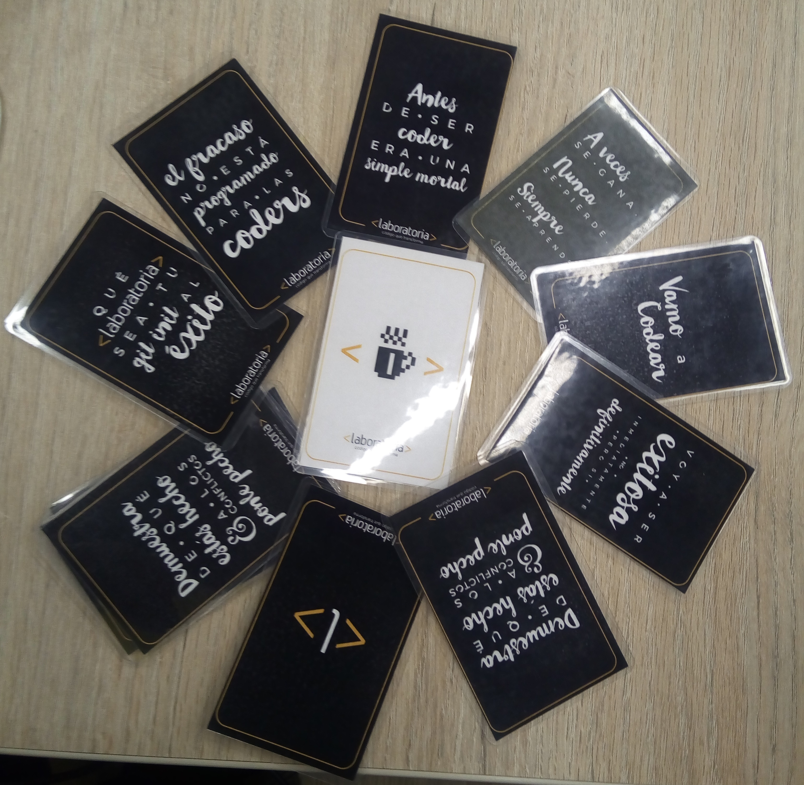
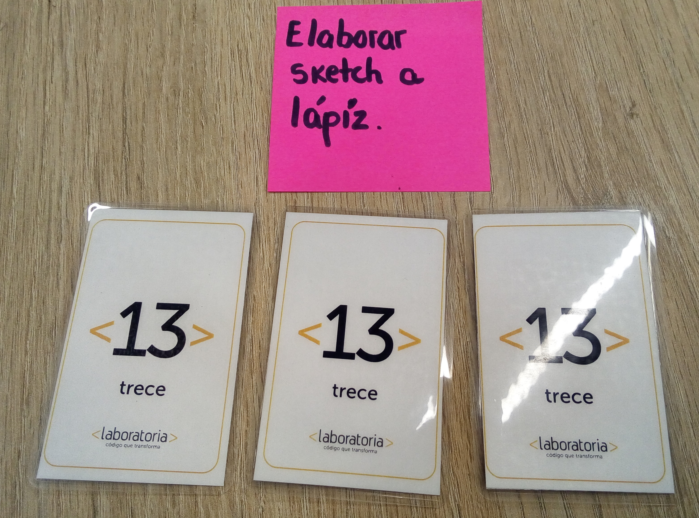
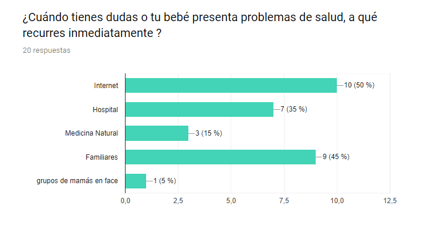
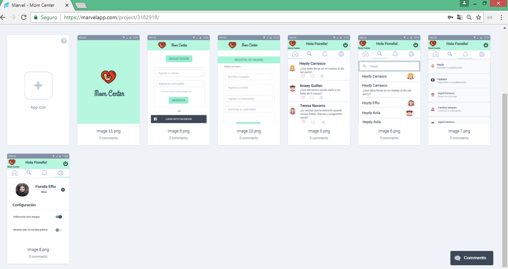
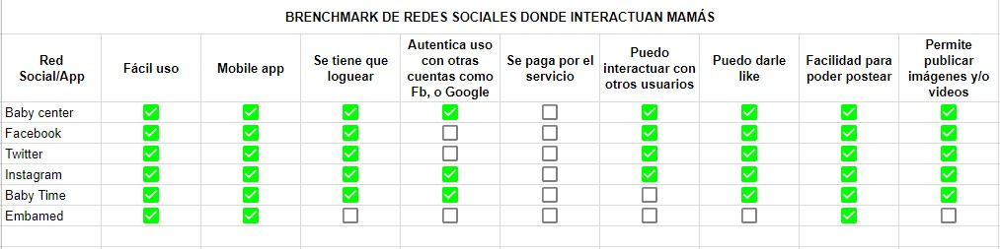
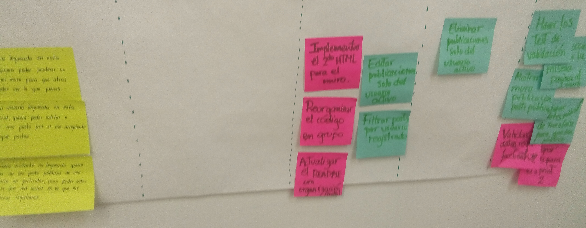

# Red Social para Mamis - Mom Center

## Elementos básicos de la red social

* 1. Que cubra la necesidad de interacción con los usuarios.
* 2. Que sea visualmente atractiva a los ojos del cliente y los usuarios, generando a través de ello una experiencia
enriquecedora y satisfactoria.
* 3. El modelo de negocio de la red social es abarcar un mercado de demanda de información acerca del cuidado de la madre
y el recién nacido, donde entre expertos y usuarias brinden pequeños tips pero sin excluir al sistema de salud.

## Usuarios

Esta red social está enfocada en mamás y o personas encargadas del cuidado de un recién nacido o niños pues busca la relación más confiable entre pediatras y/o otros especialistas ya sea en tips o sugerencias de determinados casos.

## Necesidades del usuario

El crecimiento de la tasa de natalidad en el Perú y con la problemática que genera el sistema de salud en nuestro
país trae consigo que muchas mamis se sientan desprotegidas y opten por buscar información en fuentes no tan
confiables de internet. Por ello creemos que ellas necesitan acceder a una fuente confiable de información como
es el caso de nuestra red social que unirá especialistas y mamás.

## Problemas que resuelve Mom Center

Busca acortar la brecha y confianza entre especialistas y mamás porque muchas veces preferimos el consejo de la abuelita o la vecina
para el cuidado de los niños porque si funciono con su hijo también funcionará con el mío. En esta red social podrá ver como
interactuan especialistas y mamás y verá que durante los consejos que den es primero llevar a su niño a un doctor y no perder
ese lazo de cuidado de la salud pública.

## Objetivos

1. Conectar a mamis con pediatras para solucionar algunas dudas durante la etapa de gestación así como los cuidados del recién nacido.

2. Generar conciencia de que la salud de un recién nacido o niño no solo se "cura" con los tips recibidos de la abuelita.

3. Fortalecer vínculos entre especialistas y madres.

4. Entender que todo cuerpo humano y sistemas no actúan igual a otro, todos somos diferente. Por lo tanto un medicamento no
puede demorar diferentes días en aliviar un problema.

5. Incentivar el uso racional de los medicamentos.

## Funcionalidad del Producto

Mom Center es una red social con vistas disponibles para desktop y celulares móbiles, donde al interactuar en primer lugar con nuestra red social,
necesitarás registrarte o loguearte a través de Facebook o Google que son las aplicaciones más usadas.
En la parte izquierda de la pantalla encontrarás un menú despegable donde te permitirá desplazarte a las diferentes
interfaces:
* Un muro de publicaciones públicas de las personas que sigues.
* Buscar amigos y poder seguirlos en la applicación.
* Notificaciones, por ejemplo si alguien le dió like a una publicación o si alguien empezó a seguirte.
* Perfil, aquí podrás encontrar aquellas publicaciones de privacidad para amigos. Además encontrarás un lugar donde poder publicar tus comentarios.
* Salir, para poder salir de la aplicación.

## Verificación de viabilidad del producto

Para saber que nuestro tema era interesante y atractivo para otras mamás, en entrevistas nos dimos cuenta que suelen usar
muy poco redes sociales de este fin y si lo hacen es Baby Center, una app muy buena pues maneja mucha información.
Les agrada mucho el tema de tener diferentes campos donde estructuramos la visualización de la información.

## Asegurar que los usuarios prefieran usar nuestro producto

Entre una de las preguntas de nuestras entrevistas y al finalizar nuestros testing les preguntamos si sería una
red social que usarían y recomendarían a sus amigos ynos dijeron que si y ressltaron varias cosas que les gusto de la
aplicación al igual que recomendaciones de donde mejorar algo.

## Implementación

Este proyecto se basa en un periodo de 3 sprints, los cuales hemos estructurado y planificado nuestro proyecto de la
siguiente manera:

### Primer Sprint

Para este primer proyecto la organización está basada en un Product Backlog de *Historias de Usuarios* con lo cuál las
tareas planificadas son:

Cada una de las tareas fueron aplicadas de acuerdo a un planning poker de Laboratoria, la finalidad es poder entender cada uno de
nuestros tiempos y poder lograr comprendernos mejor.

Esta imagen muestra un ejemplo de lo que comprendemos que una tarea nos puede tomar el mismo esfuerzo para lograr mejorar nuestro trabajo
en equipo.

### 1) Definir Tema, nombre, colores y usuarios

Nos enfocamos en la problemática de nuestro país y empezamos a trabajar en ello. Preparamos una encuesta virtual para
llegar a más usuarios y conocer lo que desean.

[Encuesta] (https://docs.google.com/forms/d/e/1FAIpQLSeCWPjr1TOdrSDa4-GY00Jt80uofd25uFRGZ7LSpB-eqM743A/viewform)

### 2) Diseñar un sketch a mano

Nos fue más fácil trabajar todo nuestro diseño en una pizarra, como base en una red social sencilla y de pocos pasos
para nuestros usuarios.

### 3) Definir un prototipo de alta fidelidad

Usamos Marvelapp para desarrollar el diseño de alta fidelidad porque muestra de una manera más real como llegar a
usarlo. Hagan click aquí!

[Marvel](https://marvelapp.com/3a0001f/screen/45389678)

### 4) Hacer la conexión con Firebase

Para esto se creó un HTML y un archivo Javascript para poder copiar los códigos de conexión al proyecto y tenga
la autenticación del login con otras redes sociales como Facebook y Google.

### 5) Modificación de Estilos CSS al diseño

Se modifica y ajusta el HTML para que se muestre conforme lo diseñado en el prototipo de alta fidelidad, con la finalidad de poder testear con usuarios.

### 5) Brenchmark de aplicaciones o redes sociales

Como tarea principal del proyecto fue plasmar las principales redes sociales y hacer un comparativo de lo que cumplen para cada tipo de
usuario, encontrando funcionalidades espectaculares en unas y un "ésta aplicación sería mejor si pudiera hacer ...".

[Brenchmark](https://docs.google.com/spreadsheets/d/1-umWJZIVBCSEnscqi40Gh_tZ5fD0ggap0Hwk06ND-l8/edit#gid=0)

### Segundo Sprint

Para esta segunda presentación la organización está basada en un Product Backlog de *Historias de Usuarios* con lo cuál las
tareas planificadas son:

### 1) Modificación de Estilos CSS al diseño

Desde un primer momento iniciamos nuestros estilos en base a CSS y no lograbamos que se aprecie
lo que verdaderamente buscabamos, y por sugerencia de nuestras compañeras decidimos implementar Materialize
a nuestro proyecto, pues es un framework que ya cuenta con estilos de modo responsive.

### 2) Funcionalidad de la red social

La librería que se empleó para el proyecto fue Vanilla Js, pues al conocer más su semántica fue más cómodo trabajar este
poyecto, además que ahorrabamos tiempo. Nuestras ambiciones para este sprint fueron las de poder hacer publicaciones mostrando la
data que almacenaba firebase cada que alguien lo usaba.

### 3) Aplicación de testing a usuarios

Los usuarios a los que se entrevistó, lo hicimos a través de nuestro prototipo en Marvel a través de estas entrevistas se logró manejar mejor
nuestra red social, recibimos mucho feedback como manejar mejor los colores, logo, o pensar en como vamos a redireccionar algunas vistas.

### 4) Entrevistas directas a usuarios

* Nancy Urcia - Mamá de 2 niños

¿Qué redes sociales usas con frecuencia?
*Uso más Facebook y Whatsapp.*

¿Logras encontrar temas de maternidad como primera información ahí?
*No, porque más encuentro fotos de mis amigos o cosas graciosas que ellos comparten.*

¿Te gustaría usar una red social dónde puedas encontrar información de maternidad y/o consejos?
*Sí, porque cuando mi hijito mayor le empezó una alergía además de recurrir a doctores, ninguno supo darme una explicación clara y solo me recetaban jarabes y cremitas, que muy facilmente eran caseras.*

¿Te gustaría interactuar con otras mamás acerca de algún tema en específico?
*Sí, por el tema de la alergia de mi hijo entré a varios foros y encontraba consejos de otras mamás que pasaban por lo mismo que yo.*

¿Recomendarías una red social de ese tema a tus amigos?
*Sí, porque sería de mucha ayuda para todos.*

* Karen Moreno - Estudiante de psicología y cuida a muchos de sus primitos pequeños.

¿Qué redes sociales usas con frecuencia?
*Uso más Facebook, Instagram y Whatsapp.*

¿Logras encontrar temas de maternidad como primera información ahí?
*No, porque más encuentro fotos de mis amigos o publicaciones que ellos comparten o memes.*

¿Te gustaría usar una red social dónde puedas encontrar información de maternidad y/o consejos?
*Sí, porque cuando cuido a mis primos menores muchos de ellos hacen actividades diferentes y es difícil controlarlos al mismo tiempo, mientras algunos duermen y otros quieren jugar. Sería de mucha ayuda encontrar tips de como hacerlos dormir a todos juntos, por ejemplo.*

¿Te gustaría interactuar con otras mamás acerca de algún tema en específico?
*Sí, por el tema de tips o sugerencias de comidas que son buenos para los bebés y niños.*

¿Recomendarías una red social de ese tema a tus amigos?
*Sí, porque sería de mucha ayuda para todos. Porque tengo muchas amigas y amigos que son padres primerizos.*

### Tercer Sprint

Para esta tercera presentación la organización está basada en un Product Backlog de *Historias de Usuarios* con lo cuál las
tareas planificadas son:

### 1) Aplicación de testing a usuarios

Los usuarios a los que se entrevistó, lo hicimos a través de nuestro proyecto ya despeglado en *Github* a través de estas entrevistas
recibimos mucho feedback acerca del tiempo de espera para poder loguearse, hasta observamos si habian errores de doble publicación o más
problemas técnicos como ese.

## Fallas del producto durante la entrevista - Testing:

1. En prototipo de alta fidelidad:

* No les agraba el color porque lo sentían con tono apagado como el sector salud en nuestro país.

* No sabian si la sección buscar iba a cumplir con cualquier tema en espcífico como nombres, páginas web registradas, productos
marcas, empresas, doctores, lugares, etc.

* Y en perfil querían encontrar sus mensajes, no la sección de configuración.

2. Con la estructura modificada del HTML a través de github:

* Corrección de color, no les agradaba tener en color rosado la aplicación porque si tenían un hijo varón era más algo de
personalidad y sin darnos cuenta habíamos escogido colores que la sociedad estereotipa para el tema de maternidad.

* Mucho demoraban cuando tenían que registrarse porque la contraseña tenía muchos campos que validar al tener 8 caracteres.

* Las últimas publicaciones las envía al final de la lista.

## Recomendaciones que nos dieron unas usuarias de las entrevistas:

* Karen Moreno (18 años)

*Cuando se registren e ingresen por primera vez, que haya un texto como de bienvenida o algo así como una pestaña de sugerencias. Cuando editaba no sabia que el botón de guardar era ese.*

* Nancy Urcia (42 años)

*Antes de la parte de registro me gustaría saber de que trata la aplicación para poder animarme a ingresar, pude observar que es muy parecido a tener una cuenta de facebook. Me agrada*

## Colaboradoras del Proyecto:

* [Heydy Carrasco](https://github.com/HeydyCH/lim-2018-05-bc-core-am-socialnetwork)
* [Fiorella Effio](https://github.com/FiorellaEffio/lim-2018-05-bc-core-am-socialnetwork)
* [Anaey Guillen](https://github.com/AnaeyGuillen/lim-2018-05-bc-core-am-socialnetwork)
